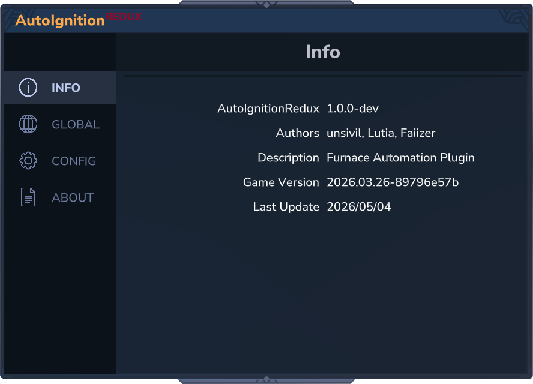
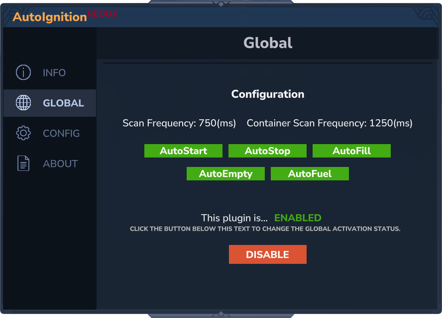
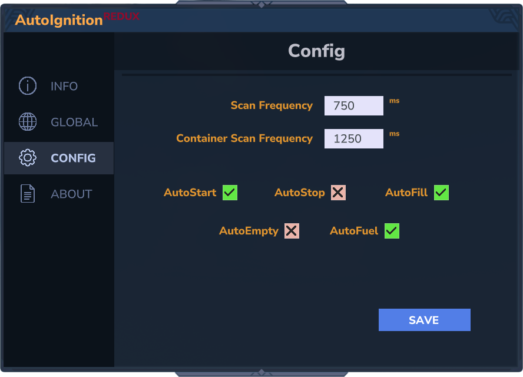
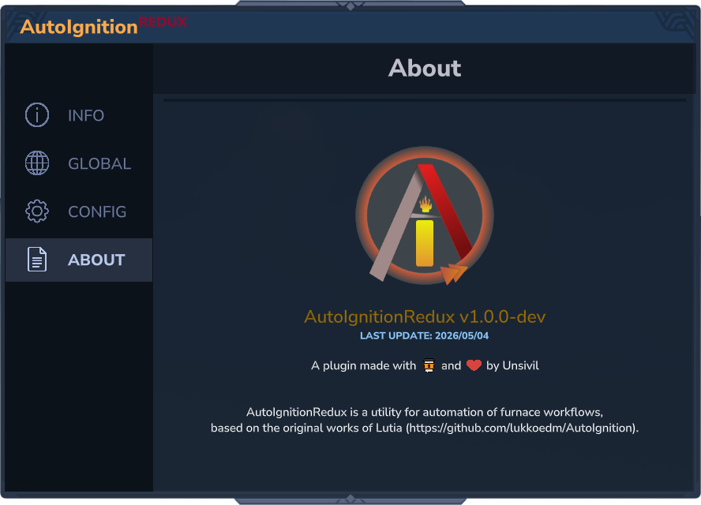

# AutoIgnitionRedux 🔥
> a Hytale furnace automation plugin

### 🖼️ Gallery
<span style="display: flex; gap: 25px;">
    <a href="assets/gui_info.png">
        
    </a>
    <a href="assets/gui_global.png">
        
    </a>
    <a href="assets/gui_config.png">
        
    </a>
    <a href="assets/gui_about.png">
        
    </a>
</span>

### ⚙️ Configuration
_example configuration_ -- `AutoReduxConfig.json`
```
{
  "ConfigVersion": 1, // DONOTCHANGE
  "ScanInterval": 750,
  "ScanNeighborInterval": 1250,
  "AutoStart": true,
  "AutoStop": false,
  "AutoFuel": true,
  "AutoEmpty": false,
  "AutoFill": true
}
```
---
`ScanInterval` _duration between scans for furnaces in loaded chunks_
> duration in milliseconds -- 500<sup>ms</sup> (min)

`ScanNeighborInterval` _duration between scans for adjacent containers to link to furnaces_
> duration in milliseconds -- 1000<sup>ms</sup> (min)

`AutoStart` _start furnace smelting if all requirements are met_
> [true|false]

`AutoStop` _stop furnace from running on empty inputs_
> [true|false]

`AutoFuel` _automatically attempt to refuel the furnace from either output (charcoal) or adjacent containers_
> [true|false]

`AutoEmpty` _attempt to empty output contents into adjacent containers_
> [true|false]

`AutoFill` _attempt to fill input from adjacent containers_
> [true|false]

</br>

### 🔒 Commands & Permissions

| COMMAND | NODE | DESCRIPTION |
| ------------------------- | ---- | ----------- |
| /autoignition                         | `autoignitionredux.commmands` | _base permission_ <br/>Also grants access to the gui menu |
| /autoignition&nbsp;config             | `autoignitionredux.commands.config` | _configuration permission_ </br>Can alter plugin configuration in menu |
| /autoignition&nbsp;config&nbsp;reload | `autoignitionredux.commands.config.reload` | _configuration reloading permission_ </br>allows reloading of configuration from file |
| /autoignition&nbsp;global&nbsp;             | `autoignitionredux.commands.global` | _global control permission_ </br>Separate from configuration. Allows global enable/disable of the plugin through commands and menu |
> _command aliases `/ai` and `/air`

<br/>

---
# 🔧 Installing

Grab the latest compiled version from the [latest releases](github.com/unsivilaudio/AutoIgnitionRedux/releases/latest) and drop it in your Hytale server's `mod` folder. This plugin ships with sensible defaults, and you should not have to configure anything if you do not want to.

<br/>

---
# ⛏️ Building

This is a <span style="color: orange;">**Maven**</span> project.  Included in the `pom` file is a custom profile for building and running your development server. 
<br/>
In the `pom.xml`, if necessary, update the current game version. 
```xml
<dependency>
    <groupId>com.hypixel.hytale</groupId>
    <artifactId>Server</artifactId>
    <!-- UPDATE WITH LATEST VERSION & ADD TO RESOURCES -->
    <version>2026.03.26-89796e57b</version>
    <scope>provided</scope>
</dependency>
```
<br/>

In [server.properties](github.com/unsivilaudio/AutoIgnitionRedux/server.properties), you need to properly configure your Hytale development server path and release type.  
```
hytale.server.kind=release
hytale.server.dir=C:\\Users\\Trinity\\AppData\\Roaming\\Hytale\\install\\${hytale.server.kind}\\package\\game\\latest
hytale.plugins.dir=${hytale.server.dir}\\Server\\mods
```
<br/>
After which, simply enable the `build-and-run` profile if using the Maven build tools extension, and run the `install` lifecycle.  The compiled JAR will be built and transferred to your server's `mod` folder and the server started afterward.
<br/><br/>

Alternatively, you can run profile in terminal of your local project.
> `mvn install -P="build-and-run"`

<br/>

---
# 💬 Issues & Feedback
Please report any issues you encounter in the [issue tracker](github.com/unsivilaudio/AutoIgnitionRedux/issues).  Suggestions for future functionality also encouraged.  Big thanks to [Lutia](https://github.com/lukkoedm) for the basis for this plugin. 😊